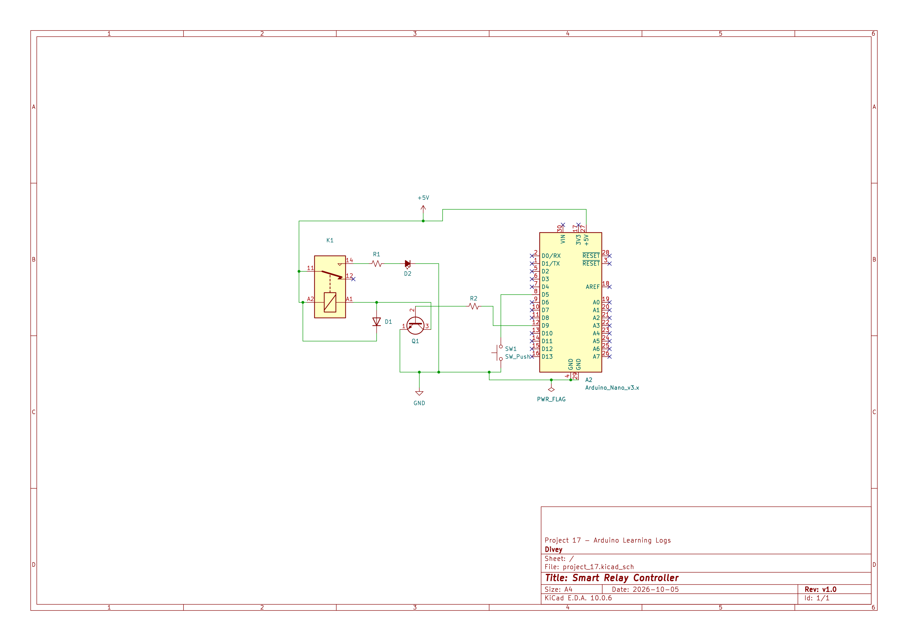
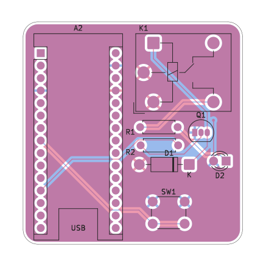
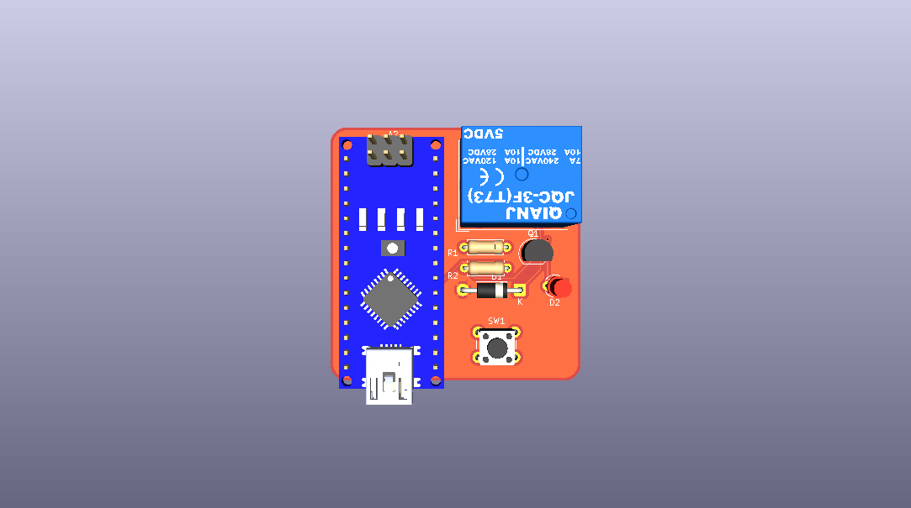
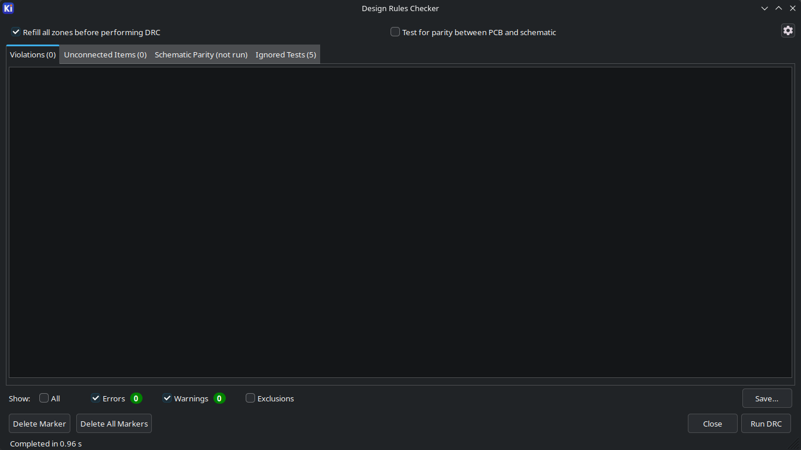

# Smart Relay Controller – PCB (KiCad)

This folder documents the PCB version of Project 17, the [Smart Relay Controller](../README.md). It is the first PCB I have designed, and the first one in this log.

The main README covers the breadboard project: how it works, the concepts involved, and the challenges I ran into. This file only covers the PCB: what I designed, how I designed it, what went wrong along the way, and what has and has not been checked.

## Status

| Stage | Status |
|---|---|
| Schematic completed | Yes |
| Schematic ERC | Checked, passes |
| PCB layout designed | Yes |
| PCB DRC | Checked: 0 errors, 0 unconnected items, 0 warnings |
| 3D fit check | Done: components fit on the board (relay shown with a stand-in 3D model) |
| Footprints vs datasheets | Done: every component matches (not checked against physical parts) |
| Gerber / drill files generated | No |
| Fabricated | **No** (design only) |
| Assembled | **No** |
| Physically tested | **No** |

**In short: designed in KiCad and checked with ERC, DRC, a 3D fit check and a datasheet check of every footprint. Not fabricated, assembled or tested, and I am not going to fabricate it.** These are checks on the design. They do not show that a fabricated board would work.

## Why I Made It

My main reason was to learn more about PCB design, and the best way to do that seemed to be designing boards for circuits I am already familiar with. Project 17 was already built on a breadboard, so the new part was the PCB process: schematic, footprints, layout, and the checks in between. It also took the circuit one step past the breadboard. I am designing the board, not fabricating it.

## What's on the Board

Resistor values were taken from the breadboard circuit, not redesigned for the PCB.

| Ref | Part | KiCad footprint |
|---|---|---|
| A2 | Arduino Nano V3.x | `Module:Arduino_Nano` |
| D1 | 1N4001 (flyback diode) | `Diode_THT:D_DO-41_SOD81_P10.16mm_Horizontal` |
| D2 | LED | `LED_THT:LED_D3.0mm_FlatTop` |
| K1 | JQC-3FC(T73) DC 5 V relay (SPDT) | `Relay_THT:Relay_SPDT_Hongfa_JQC-3FF_0XX-1Z` |
| Q1 | S8050 NPN transistor | `Package_TO_SOT_THT:TO-92_Inline` |
| R1 | 220 Ω | `Resistor_THT:R_Axial_DIN0207_L6.3mm_D2.5mm_P7.62mm_Horizontal` |
| R2 | 1 kΩ | `Resistor_THT:R_Axial_DIN0207_L6.3mm_D2.5mm_P7.62mm_Horizontal` |
| SW1 | Pushbutton | `Button_Switch_THT:SW_PUSH_6mm_H4.3mm` |

Connections as drawn in the schematic:

- D5 → SW1 → GND (the button is meant to use the Arduino's internal pull-up)
- D9 → R2 → Q1 base; Q1 emitter → GND; Q1 collector → K1 coil (low side)
- K1 coil (other side) → +5 V, with D1 across the coil for flyback protection
- K1 contacts: COM (11) → +5 V, NO (14) → R1 → D2 → GND side; NC (12) unused
- The Arduino and the switching circuit share one +5 V net and one GND net

The full-resolution schematic is in [`docs/schematic.pdf`](docs/schematic.pdf).

## Workflow

Schematic → ERC → footprint assignment → PCB layout → placement → routing → GND copper zone → DRC → 3D inspection.

I finished the schematic before starting the layout.

## Design Decisions

**Uno R3 → Nano V3.x.** The breadboard version uses an Arduino Uno R3, and the PCB started out with an Uno R3 symbol and footprint. During the final design I replaced it with an Arduino Nano V3.x symbol and footprint (`Module:Arduino_Nano`) in both the schematic and the PCB. I did it for convenience for whoever fabricates the board: the Nano has male pins, unlike the Uno's female headers, so it can be placed directly on the PCB. The connections the circuit uses (D5, D9, +5 V, GND) stay the same.

The intended arrangement is to place the Nano directly on the board through its pins. Nothing has been built, so this has not been tested.

**Two layers, GND as a copper zone.** The board has two copper layers. F.Cu carries the +5 V copper, and B.Cu is a GND copper zone. I used a zone for GND instead of routing one large GND trace by hand. The other connections were routed manually.

**Resistor values kept.** R1 (220 Ω) and R2 (1 kΩ) come from the physical Project 17 circuit. I did not recalculate them for the PCB.

**Relay footprint.** The footprint library name (`Relay_SPDT_Hongfa_JQC-3FF_0XX-1Z`) does not match the physical relay I have, which is a JQC-3FC(T73) DC 5 V. I picked it because its pad arrangement corresponded to the arrangement of my relay. A different name does not make a footprint wrong, but its geometry has to match the real part. I checked the footprint against the JQC-3FC datasheet (hole spacing, body outline, drill sizes and pad numbering) and it matches (see Verification).

**S8050 footprint.** I used `TO-92_Inline`. The symbol and footprint pin numbering correspond in KiCad, and I checked the S8050's pin order against its datasheet, which matches.

## Board

- KiCad 10.0
- 2 copper layers: F.Cu (+5 V copper), B.Cu (GND zone)
- Rounded rectangular outline, approximately 45.3 mm × 45.2 mm (X 172.5 → 217.8 mm, Y 75.6 → 120.8 mm in KiCad's coordinates)

I have not recorded trace width, clearance or board thickness for this board, so I am not listing them.

*The relay in this render is a stand-in 3D model of the 3F version, because I could not find a model for the JQC-3FC(T73).*

## Verification

**ERC (schematic):** passes after the fixes described under Challenges.

**DRC (PCB), final result:**

- Errors: 0
- Unconnected items: 0
- Warnings: 0

DRC checks the layout against KiCad's rules. It does not check that the footprints match the real parts, and it says nothing about how a fabricated board would behave.

**3D inspection:** I used KiCad's 3D viewer to check that the components fit on the board. I could not find a 3D model for the JQC-3FC(T73), so the relay in the render is a model of the 3F version, which has essentially the same dimensions. This is a visual fit check against that stand-in model. The relay footprint itself was checked separately against its datasheet (below).

**Footprints against datasheets:** I checked every component's footprint against its datasheet, and everything matched:

- Relay (JQC-3FC): hole spacing, body outline, drill sizes and pad numbering
- S8050: pin order against the symbol
- D1 and D2: polarity
- Pushbutton: pin pairs
- Nano: footprint and the D5, D9, +5 V and GND pins

These are checks against datasheets and the footprints, not against built hardware.

## Challenges

**ERC power errors.** The first ERC runs failed on power-related problems:

1. I had put a `PWR_FLAG` on the +5 V net. That caused a power-output conflict, because the Arduino symbol already defines its +5 V pin as a power output. I removed the +5 V `PWR_FLAG`.
2. The GND net did need a `PWR_FLAG` for ERC to pass, so I added one.
3. The Arduino's GND pins were treated as unused. I connected them to GND.
4. Unused Arduino pins got No Connect markers.

After these fixes the schematic passed ERC.

**Silkscreen warnings.** DRC reported "Silkscreen clipped by board edge" warnings. They were cosmetic, and I cleared them, so the final DRC has no warnings.

**Layout.** Once the schematic and footprints were sorted out, the layout was relatively straightforward, and easier than I expected. I did not run into major placement, routing or 3D-check problems.

## Not Verified

- The footprints were checked against datasheets, not against the physical parts, because nothing has been built.
- No board has been fabricated, so nothing has been fitted, soldered, powered or tested. That includes the Nano on its footprint and the relay actually switching on this board.
- Gerber and drill files have not been generated.

## Files

| File | What it is |
|---|---|
| [`kicad/smart_relay_controller.kicad_pro`](kicad/smart_relay_controller.kicad_pro) | KiCad project |
| [`kicad/smart_relay_controller.kicad_sch`](kicad/smart_relay_controller.kicad_sch) | Schematic |
| [`kicad/smart_relay_controller.kicad_pcb`](kicad/smart_relay_controller.kicad_pcb) | PCB layout |
| [`docs/schematic.pdf`](docs/schematic.pdf) | Schematic export |
| [`docs/schematic.png`](docs/schematic.png) | Schematic image |
| [`docs/pcb-layout.png`](docs/pcb-layout.png) | PCB layout image |
| [`docs/pcb-3d-render.png`](docs/pcb-3d-render.png) | 3D render |
| [`docs/drc-result.png`](docs/drc-result.png) | DRC result screenshot |

Gerber and drill files have not been generated yet.