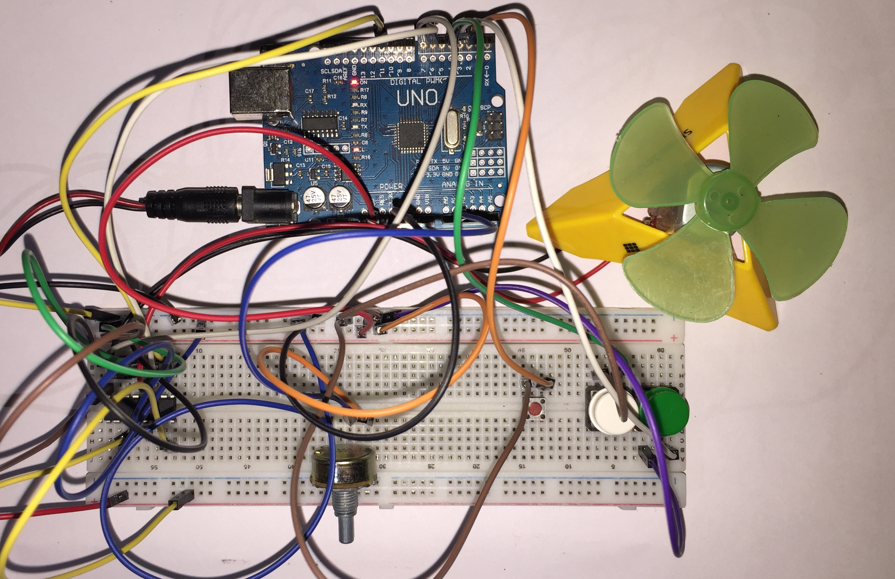

# Bidirectional DC Motor Control with an L293D H-Bridge

## Overview

This project controls the speed and direction of a DC motor (with a fan attached) using an L293D H-bridge driver. A potentiometer sets the speed via PWM, and three pushbuttons (Forward, Reverse, Stop) control direction. It builds directly on earlier PWM and digital input work by combining them into a single interactive motor controller with proper direction switching.

## Components Used

* Arduino Uno R3
* L293D motor driver (H-bridge)
* DC motor with fan attached
* Potentiometer (speed control)
* 3x pushbuttons (Forward / Reverse / Stop)
* External 4xAA battery pack (~6 V) for motor power

## Wiring Notes

* **DIR1** → pin 7, **DIR2** → pin 6 (direction control into the H-bridge)
* **SPEED_PIN** → pin 11 (PWM into the L293D enable pin)
* **POTENTIOMETER_PIN** → A1
* **BUTTON_FOR** → pin 3, **BUTTON_REV** → pin 4, **BUTTON_STOP** → pin 2 (all `INPUT_PULLUP`)
* L293D **VCC1** (logic) → Arduino 5V rail
* L293D **VCC2** (motor supply) → external 4xAA battery pack
* All L293D ground pins tied to a **common ground** shared by the Arduino and the battery pack

Running the motor off the same supply as the Arduino's logic circuitry caused problems, which is covered below.

## How It Works

The potentiometer is read with `analogRead()` and mapped with `map()` to a PWM range of roughly 175–255, which is the range that reliably ran the motor with the fan attached — lower values usually couldn't start it.

Motor direction is represented as an enum (FORWARD, REVERSE, STOP) rather than raw pin states. This separates the program's logical state from the underlying hardware implementation. A setDirection() helper translates the current state into the required H-bridge pin outputs using a switch statement.

Each button is read every loop, and both its current and previous state are stored. A press only changes the motor's direction on the transition from HIGH to LOW, so holding a button down doesn't repeatedly re-trigger the same state change.

## Testing & Observations

With the fan attached, the motor reliably started from a stop at around PWM 200, but once it was already spinning it could keep running at around PWM 170. Manually helping it overcome the initial resistance also let it run steadily at lower PWM values. This made the difference between startup torque and running torque, and the effect of the fan's mechanical load on the current needed to get moving, pretty concrete instead of just something I'd read about.

## Challenges & What I Learned

**Motor and logic sharing one power supply caused instability.** Initially, everything ran off the Arduino's USB power. Whenever the motor stalled or ran at lower PWM values, the Arduino would intermittently reset and the Serial output would get corrupted. Splitting the L293D's logic supply (VCC1, from the Arduino) from its motor supply (VCC2, from the external battery pack) fixed it — the motor's current draw was disrupting the Arduino's own power rail.

**A missing common ground broke sensor readings.** After separating the power supplies, the potentiometer started giving incorrect readings. The cause was that the battery pack's ground and the Arduino's ground weren't connected. Without a shared ground reference, the two circuits couldn't agree on what "0 V" meant, which threw off the analog readings. Tying the grounds together fixed it. This made the "why do I need a common ground with multiple supplies" rule click in a way it hadn't before.

**Abstracting the direction logic made the code easier to reason about.** Rather than calling `digitalWrite()` on the direction pins throughout the code, wrapping that logic in `setDirection()` with an `enum` state made the main loop read more like "what should the motor be doing" instead of "which pins should be high or low."

## Known Limitations

- The minimum reliable PWM value depends on the attached mechanical load.
- The controller operates open-loop; motor speed is not measured or regulated.
- No software debouncing is implemented, as the hardware produced reliable button presses during testing.

## Concepts Reinforced

* L293D H-bridge operation
* PWM motor speed control
* Bidirectional motor control
* External motor power supplies
* Common ground requirements across multiple supplies
* Button edge detection
* `enum` as a custom data type
* Helper functions and code abstraction
* `switch` statements
* Practical motor startup vs. running torque and mechanical loading effects
  
## Possible Improvements

- Add better software debouncing to make button handling more robust against mechanical contact bounce.
- Add a startup boost that briefly drives the motor at full PWM before returning to the user-selected speed, improving reliability when starting under load.
- Add a gradual acceleration/deceleration system to reduce sudden changes in motor current and mechanical stress.
- Add a motor speed sensor, such as an encoder, to measure actual RPM instead of relying solely on the PWM value.
- Use the measured motor speed as feedback to implement closed-loop speed control.
- Add current monitoring to observe how motor load affects current draw during startup and operation.
- Expand the controller to support multiple motors using additional H-bridge channels.
  
## Media

**Demonstration:** [Watch the project demo](video/project-demo.mp4)