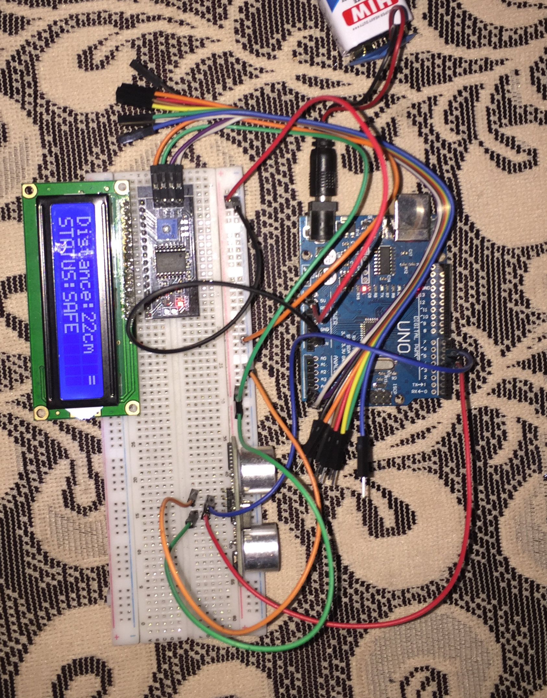
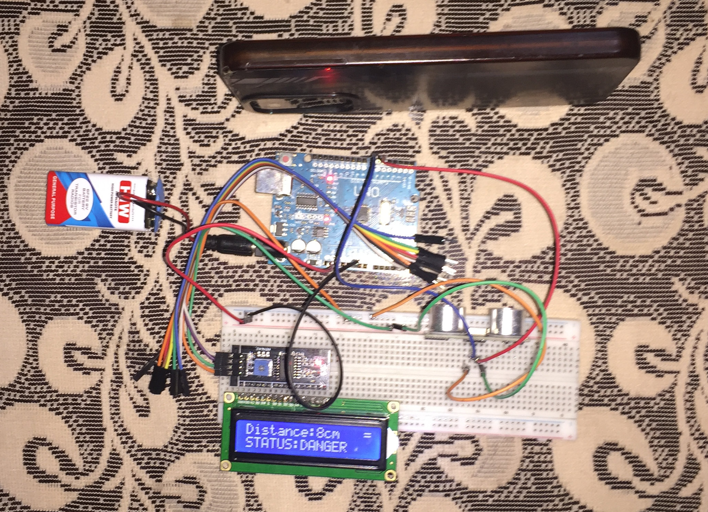
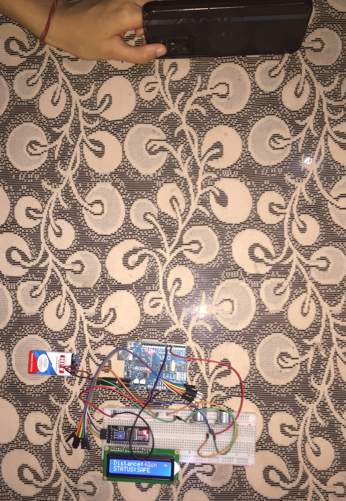

# LCD Distance Monitor

**Hardware:** HC-SR04 ultrasonic sensor, 16×2 I²C LCD (LCD1602)
**Builds on:** Project 13 (ultrasonic distance measurement)

## Overview

This project reuses the ultrasonic distance sensor from Project 13, but the sensor isn't really the point this time — I already knew how to get a distance reading out of an HC-SR04. The actual learning was on the output side: taking that reading and presenting it cleanly on a 16×2 LCD instead of the Serial Monitor.

That turned out to involve a lot more than just calling `lcd.print()`. Driving a character LCD well means thinking about fixed screen positions, custom characters, and how the display behaves when you *don't* explicitly clear it.

**System flow:**

```
HC-SR04
   ↓
Multiple distance measurements
   ↓
450 ms sampling window
   ↓
Average all samples
   ↓
Averaged distance
   ├──→ Status
   ├──→ Trend
   └──→ LCD
```

**What the LCD shows:**

```
Distance: XX cm ↑/↓/=
STATUS:  SAFE/DANGER
```

The trend arrow shows whether the object got closer, farther, or stayed the same since the last reading, and the status flips to `DANGER` when something gets within 10 cm.

---

## What I Learned

### I²C LCD Communication

This was my first time using a display, and my first time using I²C. Instead of wiring up all of the LCD's parallel data lines directly, the LCD1602 is connected through an I²C backpack, so the Arduino only needs two lines — SDA and SCL — to communicate with it.

I also learned that `lcd.init()` is a setup call, not something to run repeatedly. More on that in Challenges below.

### Cursor Positioning and Fixed-Field Layout

A character LCD isn't like the Serial Monitor — it doesn't scroll or wrap for you. I had to treat it as a fixed 16×2 grid and explicitly place things with `lcd.setCursor(column, row)`.

The tricky part was that the distance value can be 1, 2, or 3 digits (`9 cm`, `42 cm`, `123 cm`), and everything after it — the `cm` label, the trend arrow — needed to shift depending on how many digits the number took up. That meant writing separate positioning logic for each digit-count case.

### Custom Characters (CGRAM)

The LCD can't display Unicode arrows, so I built my own ↑ and ↓ characters as 8×5 bitmaps:

```cpp
byte upArrow[8] = {
  B00100,
  B01110,
  B10101,
  B00100,
  B00100,
  B00100,
  B00100,
  B00000
};
```

Then registered and displayed them with:

```cpp
lcd.createChar(0, upArrow);
lcd.createChar(1, downArrow);
...
lcd.write(byte(0));  // draws the up arrow
```

This was my first exposure to CGRAM — the small block of memory on the LCD controller that holds custom glyphs.

### Time-Windowed Sampling and Averaging

Rather than trusting a single HC-SR04 reading, I collect measurements for 450 ms and average them before updating the display, so the shown distance updates about twice a second instead of jittering with every single ping.

I didn't fix the number of samples per window — whatever number of readings fit into 450 ms gets averaged. That meant I didn't need to store each individual measurement, just a running total and a count:

```cpp
sum += distanceCm;
count++;
...
avgDistanceCm = sum / count;
sum = 0;
count = 0;
```

This was a useful contrast to Project 15, where I used arrays as fixed lookup tables. Here, since the only operation I needed was a mean, keeping individual readings around would have been wasted memory — sum and count are enough.

### Trend Indicator

The arrow on the display compares the current averaged distance to the *previous averaged* distance, not the raw reading:

```cpp
if (avgDistanceCm < previousDistanceCm) {
    lcd.write(byte(1));  // closer
}
else if (avgDistanceCm > previousDistanceCm) {
    lcd.write(byte(0));  // farther
}
else {
    lcd.print("=");
}
previousDistanceCm = avgDistanceCm;
```

I didn't add special handling for the very first reading (before `previousDistanceCm` has a meaningful value) — for a project this size, that felt like complexity I didn't need.

### Avoiding Ghost Characters and Flicker

Character LCDs don't erase old text on their own. Going from `100 cm` to `99 cm`, for example, can leave a stray `0` behind if you don't overwrite it. I handled this by explicitly writing spaces over the unused positions rather than calling `lcd.clear()` every loop — clearing and redrawing the whole screen constantly causes visible flicker and kind of defeats the point of learning controlled, partial updates.

---

## Challenges

This is where most of the actual learning happened.

**LCD initialization inside `loop()`.**
I originally had `lcd.init()` and `lcd.backlight()` running inside `loop()`. This repeatedly reinitialized the LCD, which wiped out the custom character definitions I'd loaded into CGRAM — the arrows would render as a garbled block character instead. Moving initialization into `setup()` fixed it. Small mistake, but it taught me that `setup()` vs. `loop()` isn't just a style choice — some hardware state genuinely shouldn't be reset every cycle.

**A timestamp that never updated.**
My first attempt at the 450 ms window used a `while` loop:

```cpp
currentT = millis();
while (currentT - e1S < 450) {
    // take a reading
}
```

This never worked as expected, because `currentT` was only assigned once, before the loop started — it wasn't a live clock, just a snapshot. I moved to checking elapsed time repeatedly inside `loop()` instead, calling `millis()` fresh each pass. It's not the full non-blocking multitasking approach I'm planning for Project 21, but it was my first real encounter with the idea that a timestamp variable only means something at the moment you read it.

**Getting the sample → average → restart cycle right.**
Splitting the 500 ms period into "collect for 450 ms," "average once," and "restart" took a few attempts. The averaging step needed to run exactly once per cycle, not on every pass through `loop()` while inside that window. I ended up adding an `avg` boolean flag to gate it — set `true` while collecting, checked and cleared once the averaging step runs.

**Trend arrow reacting to unfiltered data.**
After I added the averaging step, I initially left the trend comparison using the raw `distanceCm` instead of the averaged `avgDistanceCm`. The result: the arrow could flicker based on sensor noise even though the number on screen was smoothed. The fix was comparing `avgDistanceCm` against `previousDistanceCm` instead — the same averaged value the user actually sees.

**A copy-paste bug in the unit-spacing logic.**
In the cursor-positioning code for the `cm` label, one of my digit-count conditions read:

```cpp
avgDistanceCm >= 10 && distanceCm < 100
```

I'd used the raw `distanceCm` in the second half instead of `avgDistanceCm`. It's a one-character-variable-name kind of bug, but it's a reminder to double check every comparison once a variable gets renamed or a new "averaged" version gets introduced.

---

## Scope Note

The time-based sampling here is deliberately limited to this one project — dividing a fixed cycle into "collect / average / restart" using `millis()`. It's not the general non-blocking, multi-task architecture I'm planning to build out in Project 21; this was just enough time-based logic to make the averaging work.

---

## Key Takeaways

Compared to Project 13, I didn't really learn "another ultrasonic sensor project" — I reused that sensor without making it the focus. What Project 19 actually added:

- I²C peripheral communication
- LCD1602 operation and cursor-based layout
- Fixed-field formatting for variable-width numbers
- Custom characters and CGRAM
- Partial display updates without flicker
- Measurement aggregation (sum/count vs. storing every sample)
- Time-windowed sampling with `millis()`
- Separating raw sensor data from averaged/displayed data

## Media



